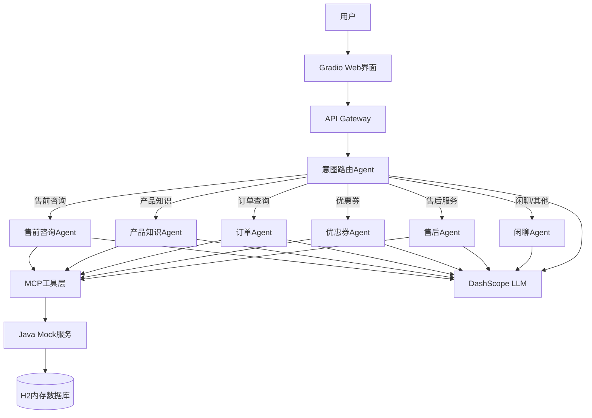
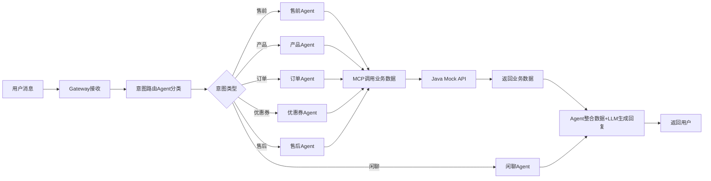
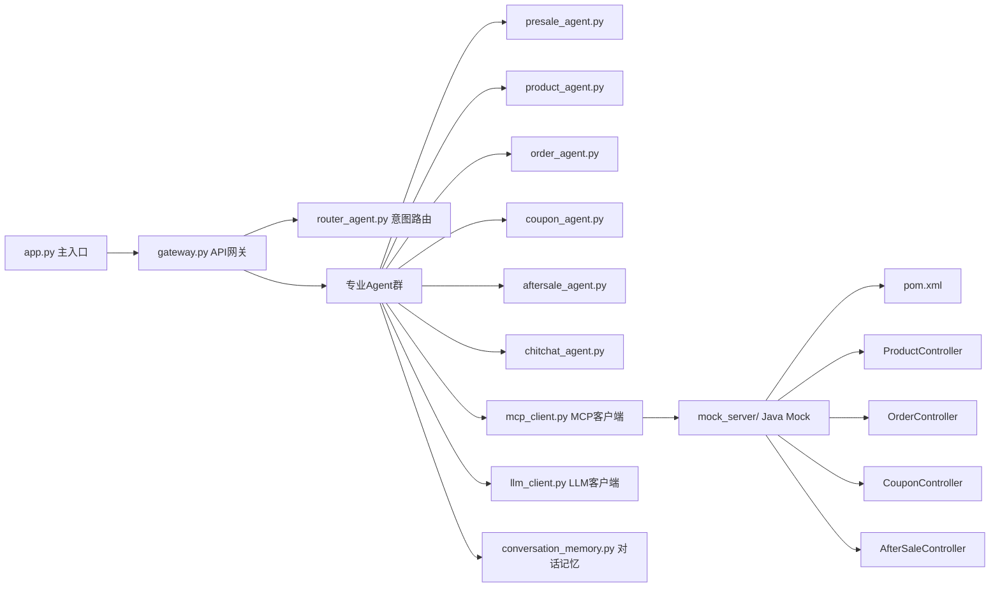

# AI电商客服系统 - 架构设计

## 1. 系统架构图



## 2. 数据流图



## 3. 模块依赖图



## 4. 数据库设计

### Java Mock服务 - H2内存数据库

**products表**：
| 字段 | 类型 | 说明 |
|------|------|------|
| id | INTEGER | 商品ID |
| name | VARCHAR | 商品名称 |
| category | VARCHAR | 分类 |
| price | DECIMAL | 价格 |
| stock | INTEGER | 库存 |
| description | TEXT | 描述 |
| specs | TEXT | 规格参数JSON |

**orders表**：
| 字段 | 类型 | 说明 |
|------|------|------|
| id | INTEGER | 订单ID |
| user_id | INTEGER | 用户ID |
| product_id | INTEGER | 商品ID |
| quantity | INTEGER | 数量 |
| total_price | DECIMAL | 总价 |
| status | VARCHAR | 状态 |
| created_at | TIMESTAMP | 创建时间 |

**coupons表**：
| 字段 | 类型 | 说明 |
|------|------|------|
| id | INTEGER | 优惠券ID |
| code | VARCHAR | 优惠码 |
| type | VARCHAR | 类型 |
| value | DECIMAL | 面值/折扣 |
| min_purchase | DECIMAL | 最低消费 |
| valid_until | TIMESTAMP | 有效期 |
| used | BOOLEAN | 是否已用 |

**after_sale_requests表**：
| 字段 | 类型 | 说明 |
|------|------|------|
| id | INTEGER | 售后ID |
| order_id | INTEGER | 订单ID |
| user_id | INTEGER | 用户ID |
| type | VARCHAR | 类型(退款/换货/维修) |
| reason | TEXT | 原因 |
| status | VARCHAR | 状态 |
| created_at | TIMESTAMP | 创建时间 |

## 5. API接口设计

### Java Mock服务 REST API

```
GET  /api/products          - 商品列表
GET  /api/products/{id}     - 商品详情
GET  /api/products/search   - 商品搜索

GET  /api/orders            - 订单列表
GET  /api/orders/{id}       - 订单详情
POST /api/orders            - 创建订单

GET  /api/coupons           - 优惠券列表
GET  /api/coupons/{code}    - 查询优惠码
POST /api/coupons/use       - 使用优惠券

GET  /api/aftersale         - 售后列表
POST /api/aftersale         - 创建售后申请
PUT  /api/aftersale/{id}    - 更新售后状态
```

### MCP工具定义

```json
[
  {
    "name": "search_products",
    "description": "搜索商品信息",
    "parameters": {"query": "string", "category": "string?"}
  },
  {
    "name": "get_product_detail",
    "description": "获取商品详情",
    "parameters": {"product_id": "integer"}
  },
  {
    "name": "query_orders",
    "description": "查询用户订单",
    "parameters": {"user_id": "integer", "status": "string?"}
  },
  {
    "name": "get_order_detail",
    "description": "获取订单详情",
    "parameters": {"order_id": "integer"}
  },
  {
    "name": "query_coupons",
    "description": "查询用户优惠券",
    "parameters": {"user_id": "integer"}
  },
  {
    "name": "check_coupon",
    "description": "验证优惠码",
    "parameters": {"code": "string"}
  },
  {
    "name": "create_aftersale",
    "description": "创建售后申请",
    "parameters": {"order_id": "integer", "type": "string", "reason": "string"}
  },
  {
    "name": "query_aftersale",
    "description": "查询售后进度",
    "parameters": {"order_id": "integer"}
  }
]
```

## 6. 技术选型

| 组件 | 技术 | 理由 |
|------|------|------|
| AI Agent框架 | Python自研 | 轻量MVP，不依赖LangChain等重框架 |
| LLM | DashScope qwen-plus | 阿里云百炼，OpenAI兼容接口 |
| 意图路由 | LLM分类 | 利用LLM理解能力做意图识别 |
| MCP客户端 | Python HTTP | 通过HTTP调用Java Mock服务模拟MCP |
| Mock后端 | Spring Boot + H2 | Java生态标准，内嵌数据库无需安装 |
| Web界面 | Gradio | 快速搭建对话式UI |
| 对话记忆 | Python dict | MVP阶段内存存储，按session_id隔离 |
| 前端 | Gradio Chatbot | 内置聊天组件 |

## 7. 多智能体通讯机制

### 7.1 路由机制
- 用户消息先进入Router Agent
- Router通过LLM判断意图，返回Agent名称
- Gateway根据路由结果分发到对应专业Agent

### 7.2 Agent间通讯
- 采用**Handoff模式**：Agent处理完毕后可将对话转交其他Agent
- 例：售前Agent发现用户问订单→转交OrderAgent
- 转交时携带上下文（原始问题+已获取的数据+已生成的回复）

### 7.3 上下文传递
- 每个session维护一个ConversationMemory
- 包含：消息历史、当前Agent、已调用工具、用户信息
- Agent切换时上下文自动传递

### 7.4 工具调用流程
```
Agent → 构造工具调用参数 → MCPClient.call(tool_name, params) 
→ HTTP请求Java Mock → 返回JSON数据 → Agent整合数据+LLM生成回复
```
